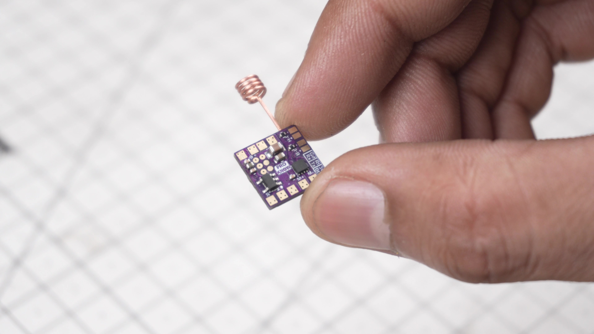
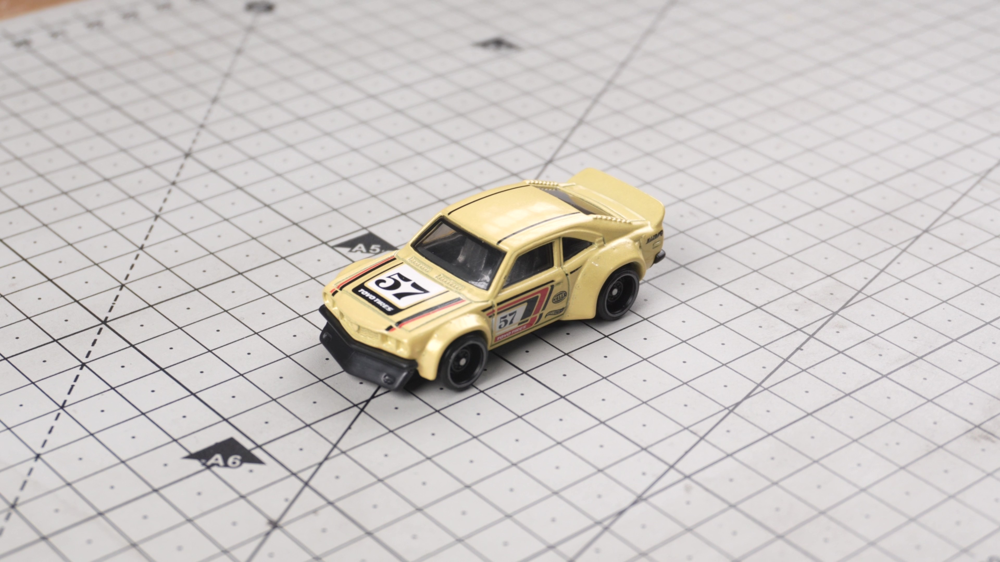
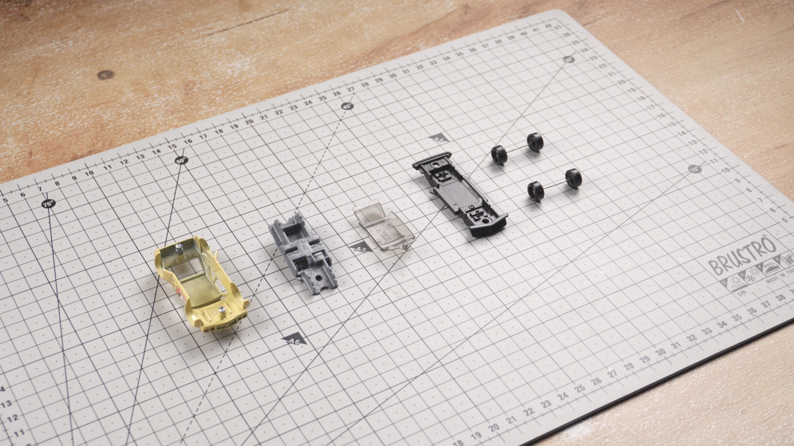
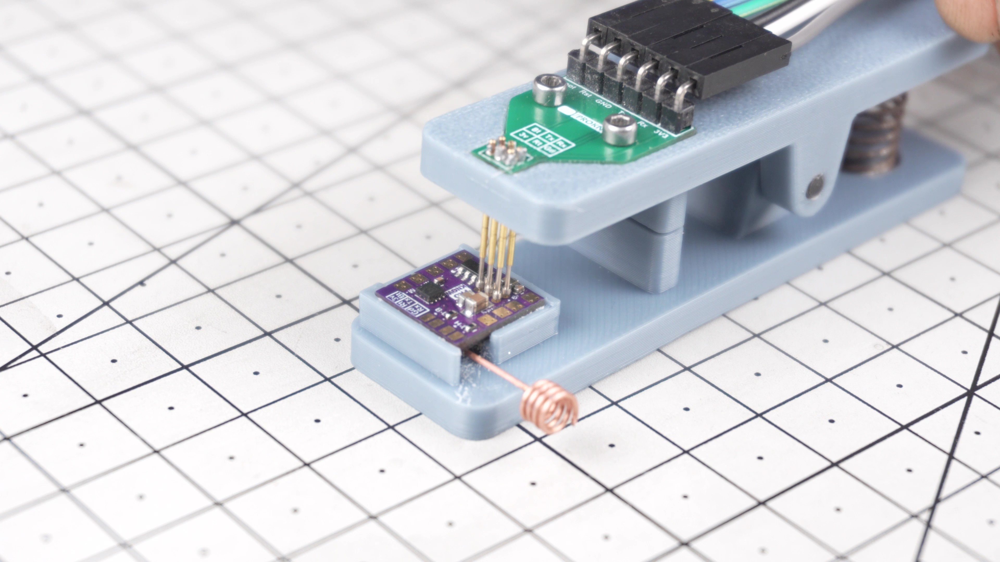
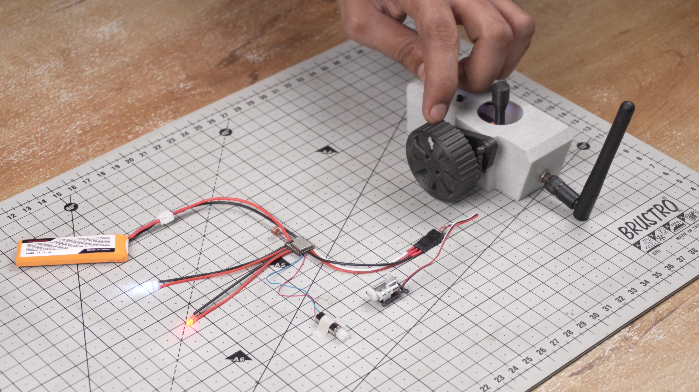
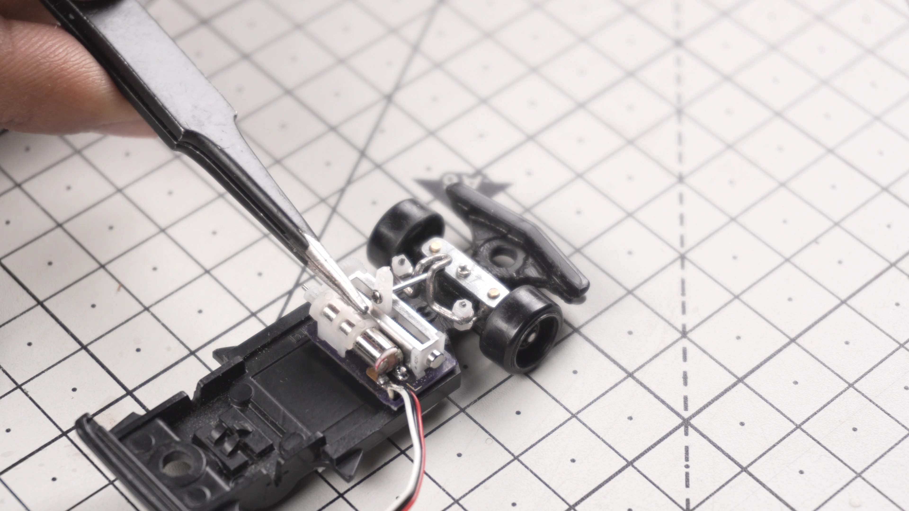
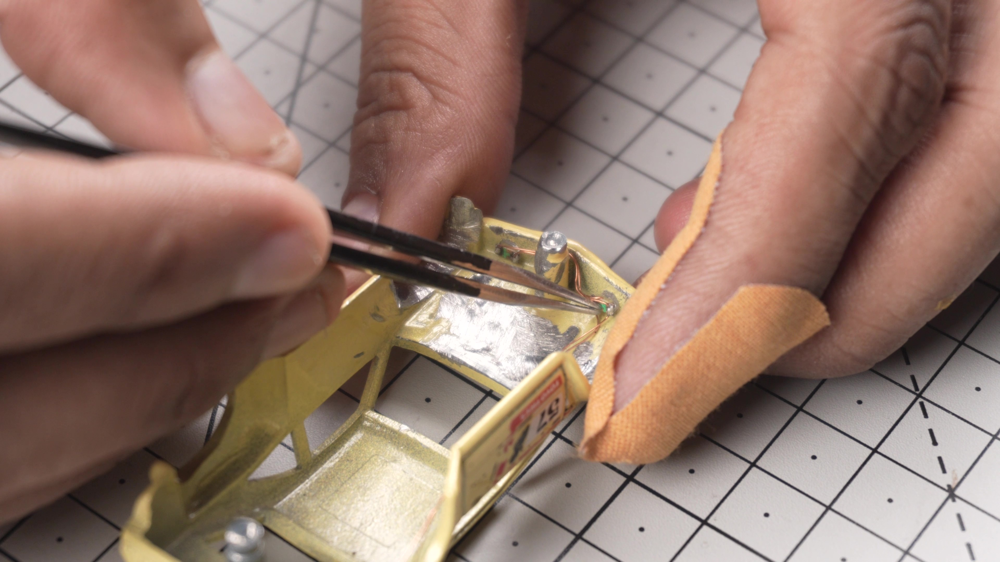
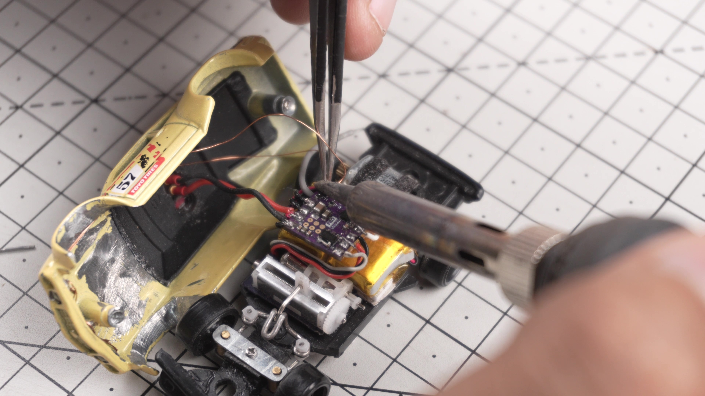

# 🚗 Converting a $3 Hot Wheels into a Custom 1:64 Scale FPV RC Drift Car

  

> A fully functional **1:64 Scale FPV RC Drift Car** built from a **Hot Wheels Mazda RX-3**, featuring **ESP-NOW wireless control**, **proportional steering**, **custom PCB**, and a **live FPV camera**.

🎥 **Watch the Full Build Video:**  
https://youtu.be/cxZGm-tz_ug

---

## 📖 About the Project

**नमस्कार मित्रों (Namaskar Mitro),**

In this project, we convert a regular **Hot Wheels Mazda RX-3** into a fully functional **FPV RC Drift Car**.

Despite weighing only **45 grams**, the car features:

- 📡 ESP-NOW Wireless Control
- 🎮 Proportional Steering
- ⚡ Proportional Motor Control
- 💡 Working Headlights
- 📷 Live FPV Camera
- 🔋 Rechargeable Li-Po Battery
- 🔌 Magnetic Charging Connector
- 🖥️ Custom 10mm × 10mm PCB

This repository contains everything required to build your own miniature FPV RC car.

---

# ✨ Features

- ESP8266 (ESP-01F) Based Receiver
- ESP32 ESP-NOW Remote Controller
- Custom 10mm × 10mm PCB
- DRV8212 Motor Driver
- 1.5g Linear Steering Servo
- Coreless Brushed Motor
- FPV Camera System
- Magnetic Charging Port
- Working Headlights
- Compact 45g Design

---

# 🖥 Custom PCB

To fit everything inside such a tiny **1:64 scale** chassis, I designed a custom **10 mm × 10 mm PCB**.

The PCB includes:

- ESP-01F Interface
- DRV8212 Motor Driver
- 3.3V LDO Regulator
- Servo Connector
- Headlight Output
- Backlight Output
- Battery Connector

This makes the electronics extremely compact and easy to assemble.

  

---

# 🛠 PCB Manufacturing

The PCB used in this project was manufactured by **JLCPCB**.

If you'd like to build one yourself:

👉 PCB Fab & Assembly from **$2**

https://jlcpcb.com/?from=ProKnow1

🎁 Premium 6-Layer PCB Coupon

https://jlcpcb.com/6-layer-pcb?from=getcoupon

---

# ⚙ Components Used

## 🌍 International

| Component | Link |
|-----------|------|
| 1.5g Linear Servo | https://s.click.aliexpress.com/e/_c3gl9WDN |
| FPV Camera | https://bit.ly/3SYVMgr |
| FPV Receiver | https://s.click.aliexpress.com/e/_c4mgQJ6b |
| Magnetic Connector | https://s.click.aliexpress.com/e/_c4bnzvun |
| MG90S Servo | https://s.click.aliexpress.com/e/_c3mX4TOF |
| 50mAh LiPo Battery | https://bit.ly/4wQY3sB |
| 2.5mm LED | https://s.click.aliexpress.com/e/_c3zbaSDH |
| 1206 SMD LED | https://bit.ly/3RqyCyO |

Additional Parts

- 2 × M2.5 × 8 mm Standoffs
- Paper Clips / Safety Pins
- 2 × Tongue Cleaners
- Micro Screws Kit

---

## 🇮🇳 India

| Component | Link |
|-----------|------|
| 1.5g Linear Servo | https://link.amazon/B0aiFIeeu |
| Hot Wheels Mazda RX-3 | https://link.amazon/B07unQC3F |
| FPV Camera | https://link.amazon/B0eynIKSm |
| FPV OTG Receiver | https://bit.ly/4wQLkpO |
| Magnetic Connector | https://bit.ly/4f9rjoz |
| MG90S Servo | https://bit.ly/4wK22Hd |
| 50mAh LiPo Battery | https://bit.ly/4bJqBMj |
| 2.5mm LED | https://bit.ly/4fHVR0I |
| 1206 SMD LED | https://bit.ly/4pAsn8w |

Additional Parts

- 2 × M2.5 × 8 mm Standoffs
- Paper Clips / Safety Pins
- 2 × Tongue Cleaners
- Micro Screws Kit

---

# 📸 Gallery

> 

  
  
  

  

  

  

  

  

  

---

# 🚀 Getting Started

1. Download the repository.
2. Manufacture the PCB.
3. Print the 3D parts.
4. Assemble the steering mechanism.
5. Solder the electronics.
6. Upload the Receiver firmware.
7. Upload the Transmitter firmware.
8. Bind using ESP-NOW.
9. Enjoy driving!

---

# ❤️ Support the Project

If you enjoyed this project:

⭐ Star this repository

👍 Like the YouTube video

📢 Share it with your friends

🔔 Subscribe to **Pro Know**

---

# 📜 License

This project is shared for **personal and educational use**.

Please do not redistribute or sell the design files without permission.
